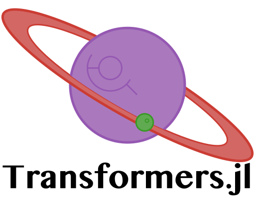

<div align="center"> </img></div>

[](https://travis-ci.com/chengchingwen/Transformers.jl)
[](https://codecov.io/gh/chengchingwen/Transformers.jl)
[](https://chengchingwen.github.io/Transformers.jl/dev/)

Julia implementation of [transformer](https://arxiv.org/abs/1706.03762)-based models, with [Flux.jl](https://github.com/FluxML/Flux.jl).

# Installation

In the Julia REPL:

    ]add Transformers
    
For using GPU, install & build:

    ]add CuArrays
    
    ]build 
    
    julia> using CuArrays
    
    julia> using Transformers
    
    #run the model below
    .
    .
    .


# Example
Using pretrained Bert with `Transformers.jl`.

```julia
using Transformers
using Transformers.Basic
using Transformers.Pretrain

ENV["DATADEPS_ALWAYS_ACCEPT"] = true

bert_model, wordpiece, tokenizer = pretrain"bert-uncased_L-12_H-768_A-12"
vocab = Vocabulary(wordpiece)

text1 = "Peter Piper picked a peck of pickled peppers" |> tokenizer |> wordpiece
text2 = "Fuzzy Wuzzy was a bear" |> tokenizer |> wordpiece

text = ["[CLS]"; text1; "[SEP]"; text2; "[SEP]"]
@assert text == [
    "[CLS]", "peter", "piper", "picked", "a", "peck", "of", "pick", "##led", "peppers", "[SEP]", 
    "fuzzy", "wu", "##zzy",  "was", "a", "bear", "[SEP]"
]

token_indices = vocab(text)
segment_indices = [fill(1, length(text1)+2); fill(2, length(text2)+1)]

sample = (tok = token_indices, segment = segment_indices)

bert_embedding = sample |> bert_model.embed
feature_tensors = bert_embedding |> bert_model.transformers
```

See `example` folder for the complete example.

# Roadmap

## What we have in v0.1.0

-   `Transformer` and `TransformerDecoder` support for both 2d & 3d data.
-   `PositionEmbedding` implementation.
-   `Positionwise` for handling 2d & 3d input.
-   docstring for most of the functions.
-   runable examples (see `example` folder)


## What we will have in v0.2.0

-   The BERT model ([JSoC 2019](https://nextjournal.com/chengchingwen))
-   tutorials
-   complete GPT APIs
-   GPT-2 model
-   docs site for this project
-   benchmarks
-   more examples


## What we might have in v0.2.0 (If we are lucky)
-   TPU support with XLA.jl
-   complete docs for datasets
-   more datasets support


## Messy checklist

-   [ ] refactor code
-   [ ] optimize performance
-   [ ] better dataset API
-   [ ] more datasets
-   [X] openai gpt model
-   [X] google bert model
-   [ ] openai gpt-2 model
-   [ ] TPU support
-   [ ] openai sparse transformer
-   [ ] benchmarks


